```{r setup, include=FALSE}
options(htmltools.dir.version = FALSE)
knitr::opts_chunk$set(
                      fig.width = 9, fig.height = 4, fig.retina = 3,
                      out.width = "100%",
                      cache = FALSE,
                      echo = TRUE,
                      message = FALSE, 
                      warning = FALSE,
                      hiline = TRUE
                      )

library(tidyverse)
library(extrafont)
loadfonts()  # Must be run once in each session (markdown is a new "session" each time you render/knit)


# We want to get the wd up to the main folder
# Need to go up two levels
# setwd('../../..')
# Double check
getwd()    # check


reportP <- function(pValue){
  if (pValue < 0.001){
    result <- "p < 0.001"
  } else {
    result <- sprintf("p = %.3f", pValue) # inserts a float into a string and simultaneously do rounding
  }
  return(result)
}

reportDec <- function(dec){
  
    result <- sprintf("%.3f", dec) # inserts a float into a string and simultaneously do rounding
  
  return(result)
}

reportDecOne <- function(dec){
  
    result <- sprintf("%.1f", dec) # inserts a float into a string and simultaneously do rounding
  
  return(result)
}

reportPercent <- function(dec){
  
    result <- sprintf("%.1f", 100*dec) # inserts a float into a string and simultaneously do rounding
  
  return(result)
}

commaNum <- function(large){
    
  result <- formatC(large, big.mark = ",", format = "f", drop0trailing = TRUE)

  return(result)
}


```


```{css, echo=F}
    /* Table width = 100% max-width */

    /* .remark-slide table{
      width: 100%;
    } */

    /* Change the background color to white for shaded rows (even rows) */

    .title-slide h3:nth-of-type(2) {
      color: red;
    } 

    .remark-slide thead, .remark-slide tr:nth-child(n) {
      background-color: #A7A9AC;
    }

    .remark-slide table {
      background-color: #A7A9AC;
    }
    
    tfoot {
      font-size: 80%;
    }

    table{
      border-collapse: collapse;
      border-color: transparent;
      background-color: #A7A9AC;
    }

    /* .hljs-github {
      background-image: url("logo.png");
      background-position: bottom left;
      background-size: 10%;
    }

    .inverse {
      background-image: url("");
      background-position: bottom left;
      background-size: 10%;
    } */

    .title-slide {
      background-image: url("logo_title.png");
      background-position: bottom left;
      background-size: 20%;
    }


```


```{r xaringan-themer, include=FALSE, warning=FALSE}
library(xaringanthemer)

style_duo(
          primary_color = "#A7A9AC", 
          secondary_color = "#006334",
          table_row_even_background_color = "#A7A9AC"
          )

```


## What are these slides about?
<br>
- Consider a project you have
<br><br>

- If you're working on your own, you know where everything is...
<br><br>
--

- But what if you're working with others?
  - What if I want to use your code to update our results file?
<br><br>
--

- Let's think through how to make this easier. On **everyone**.


---

## Consider a project I'm working on

```{r echo = FALSE}

```

- Three people
- All working with the same data
- All working with the same scripts


---

## Here's the layout of folders


```{r echo = FALSE}
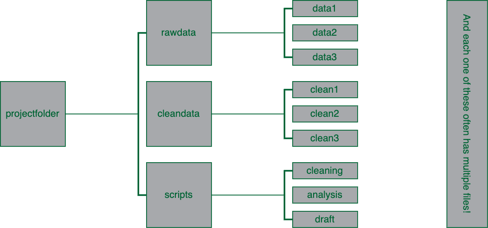
```


---

## Here are some actual folders on my computer


```{r echo = FALSE}
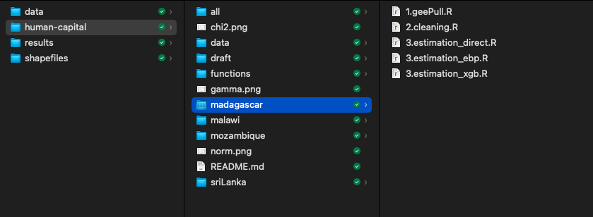
```


---

## Here are some actual folders on my computer


```{r echo = FALSE}
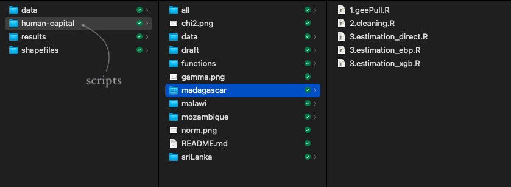
```


---

## Here are some actual folders on my computer


```{r echo = FALSE}
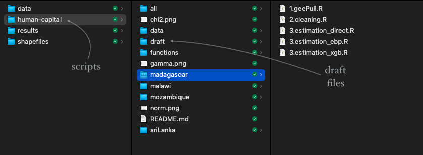
```


---

## Here are some actual folders on my computer


```{r echo = FALSE}
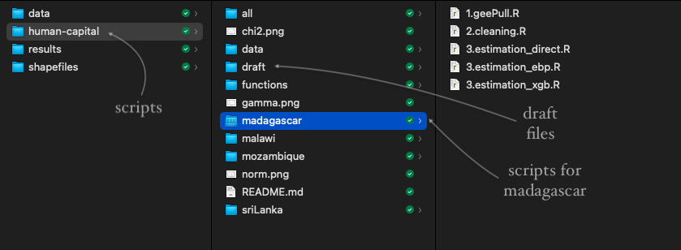
```


---

## There's stuff all over the place!
<br>
- First things first: we need to keep track of where everything is
  - We all need to be consistent in where we put stuff
<br><br>

- Second: we need to make sure that anyone's update to data/scripts are reflected in everyone's work
  - Otherwise, we run into problems
<br><br>

- Third: we need to make sure that scripts/do-files run on everyone's computers
  - Importantly, this means **we cannot be using absolute paths**
  - More in a minute


---
class: inverse, center, middle

# Keeping track of where everything is


---

## Keeping track of where everything is
<br>
- The real key here is just making sure you are consistent in where you put stuff
<br><br>
- For example, the `/data` folder on the previous slide has **all** the raw data, separately for each country
<br><br>
- The `/results` folder has **all** the results, separately for each country
<br><br>
- The `/human-capital` folder has **all** the scripts
  - This includes, cleaning, analysis, and the draft of the paper
  - Note: it's named this way because it's a (private) repository on Github


---

## Keeping track of where everything is
<br>
- You all probably do this in your own way
<br><br>
- When working with others, it's helpful to have a quick discussion at the beginning about what folders are what
<br><br>
- There's no "right" way to do this, just make sure everyone does it the same way


---
class: inverse, center, middle

# Making sure everything is up to date


---

## Making sure everything is up to date
<br>
- This is a very important part of working with others
<br><br>
- If I store things only on my computer, then you can't use them
  - This is a problem if I'm the only one who can run the code
<br><br>
- Thankfully, there are quite a few options for sharing folders
  - Dropbox, Google Drive, OneDrive, Github, etc.


---

## Which one should we use?
<br>
- I use two every single day:
  - Dropbox
  - Github
<br><br>
- However, I use them for different purposes
  - I view Github more for sharing **code**
  - I view Dropbox more for sharing **data**
<br><br>
- Important to note that you can use both for both purposes, though!


---

```{r echo = FALSE}
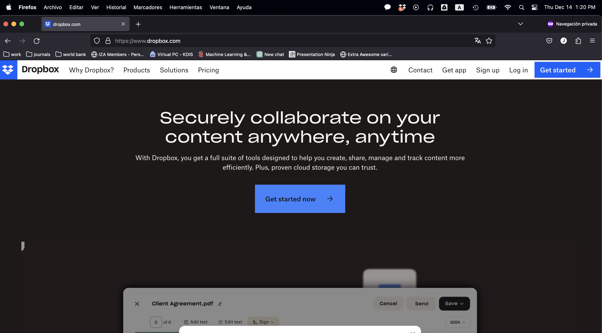
```


---

## One downside: Dropbox is not (usually) free

```{r echo = FALSE}
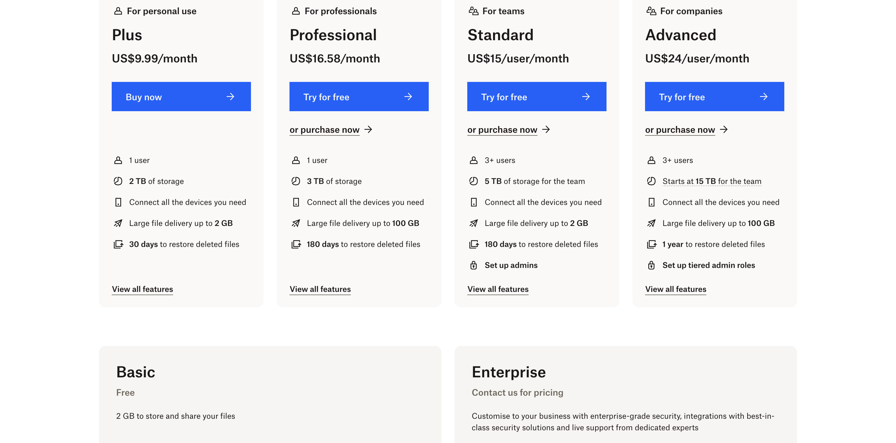
```


---

## One downside: Dropbox is not (usually) free

```{r echo = FALSE}
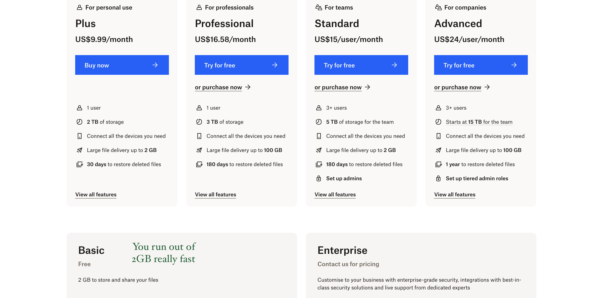
```


---

## Using Dropbox
<br>
- Once you have an account, you can download the Dropbox program/app to your computer
<br><br>
- This will create a folder on your computer
  - Here's the key: **anything** you put in this folder will be synced to the cloud
  - This means that if you have that Dropbox folder on two computers, they will be synced
<br><br>
- You can also selectively do two things:
  - Have files live only on the cloud (not on your computer)
  - Share folders with others


---

## Selective sync
<br>
- Many of my projects are quite large
  - The folder I showed you earlier is 52.5 GB
<br><br>
- When I finish a project, I don't want to keep it on my computer
  - But I also don't want to delete it
  - Instead, I leave it in my Dropbox, but I don't sync it to my computer
<br><br>
- I also sometimes do this with raw data for ongoing projects if I think I'm done with it
  - If I need it again, I can just download it from Dropbox


---

## Sharing folders with others
<br>
- This is the key part of Dropbox for me
<br><br>
- I can share a folder with you, and then we can both work on it
  - If we both have Dropbox accounts and folders on our computers, then both folders will update with any changes!
<br><br>
- This is how I work with my coauthors:
  - We have a shared folder for each project
  - I work on something today
  - My coauthor(s) can see the updated folders as soon as they open their computers
<br><br>
--


**Pretty straightforward, right?**


---

## Another benefit of paid accounts
<br>
- There's one more thing I want to point out
<br><br>
- If you have a paid account, you can see the history of changes to a file
  - This is **incredibly** useful
  - If you accidentally delete something, you can get it back
  - If you accidentally change something, you can get it back
<br><br>
- The length you can go back depends on the type of account you have
  - The cheapest one can go back 30 days


---
class: inverse, center, middle

# Making sure everything can run on everyone's computers


---

## A problematic example
<br>
- Suppose you and I are working on a project
<br><br>
- Let's say I have a folder on my computer called `C:/Users/Josh/Dropbox/Projects/Project1`
  - I have a script, and I start it like this:
<br><br>
```{r, echo = TRUE, eval = FALSE}
data <- read_csv("C:/Users/Josh/Dropbox/Projects/Project1/data.csv")
```

<br><br>
- What's the problem with this?
--

  - **You can't run this on your computer!**


---

## A problematic example
<br>
```{r, echo = TRUE, eval = FALSE}
data <- read_csv("C:/Users/Josh/Dropbox/Projects/Project1/data.csv")
```

<br><br>
- This is what's referred to as an **absolute path**
  - It's a path that is specific to my computer
  - It's not a path that will work on your computer
<br><br>
- Instead, we want to use a **relative path**
  - This is a path that is relative to the folder we're in
  - It's a path that will work on your computer


---

## Working directories
<br>
- The key to using relative paths is to make sure you're in the right folder
  - We can do this by thinking about **working directories**
<br><br>
- Let me show you an example using both Stata and R


---

```{r echo = FALSE}
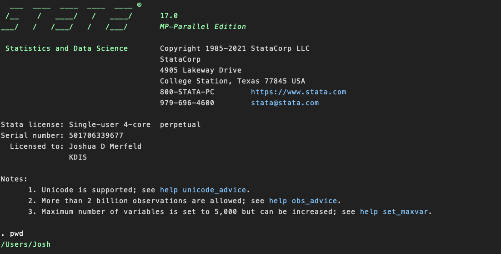
```


---

## Working directories in Stata
<br>
- You can find your current working directory by typing `pwd`
<br><br>
- You can set working directories by typing `cd "C:/Users/Josh/Dropbox/Projects/Project1"`
  - However note that this is an absolute path!
  - In other words, don't do this *in your do-file*
<br><br>
- So what do we do?
<br><br>
- A key is to understand how Stata sets working directories


---

```{r echo = FALSE}
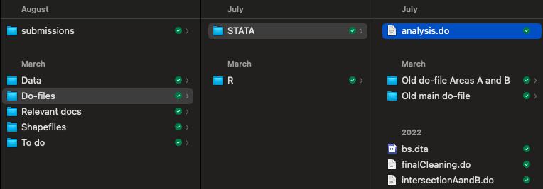
```
<br><br>

- The location of this file is `/Users/Josh/Dropbox/Papers/minWage_weathShocks/Do-files/STATA/analysis.do`
  - Let's see what happens to the working directory if we open this do-file by double clicking on it (when Stata is closed)


---

```{r echo = FALSE}
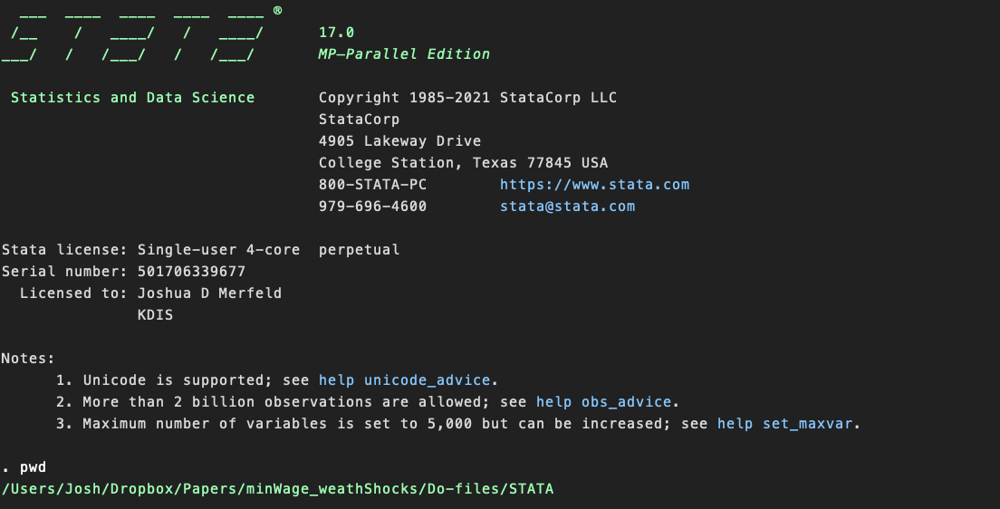
```


---

## Stata sets the wd to the folder where the do-file is located
<br>
- As long as you open the do-file by double clicking it, the wd will be set to the folder where the do-file is located
<br><br> 
- Everyone needs to be working from the *same* working directory
  - And everyone needs to set it without explicitly references the absolute path in the do-file/script
  - i.e. it's okay if you manually set the wd, but all paths in the do-file should be *relative to that path*
<br><br> 
- Let's look at setting relative paths


---

## Example

```{r echo = FALSE}
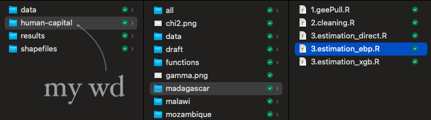
```
<br><br>

- My working directory is the `human-capital` folder
- I want to reference *all* files relative to this folder
  - For example, `madagascar/3.estimation_ebp.R` is how I would reference the file `3.estimation_ebp.R` in the `madagascar` folder


---

## Example

```{r echo = FALSE}
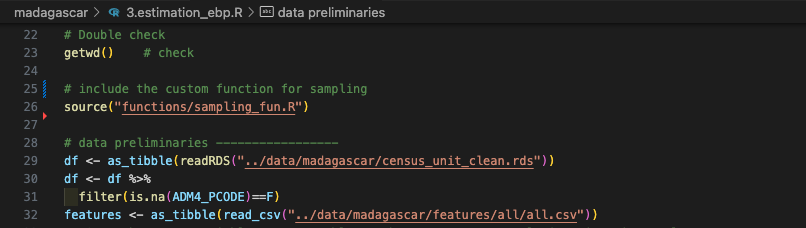
```
<br><br>

- Let's look at the first two paths


---

## Example

```{r echo = FALSE}
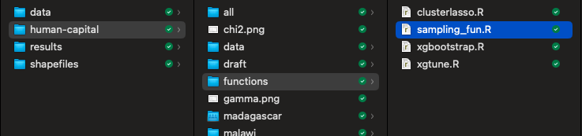
```
<br><br>

- `source("functions/sampling_fun.R")` references this file


---

## Example
<br>
- What about the path `"../data/madagascar/features/all/all.csv"`?
<br><br>
- What does the `..` mean?
  - This means to **go up one level** from the working directory
  - From the higher level, we can then go into the `data` folder


---

## Example

```{r echo = FALSE}
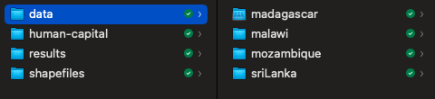
```
<br><br>

- It goes up to the folder on the left, then down into the `data` folder
  - Then into the `madagascar` folder, etc.


---

## This runs for everyone
<br>
- The key is that this will run for everyone
  - As long as everyone sets their working directory to the `human-capital` folder, *every single file in the entire project* will run for everyone!
<br><br>
- This is the key to working with others
  - Everyone needs to know what the default working directory should be
  - Everyone should make sure that all paths are relative to that working directory
  - And voila! Everyone can run everything!


---

## A short rejoinder on Github
<br>
- I find Github very useful
  - I actually put my applied microeconometrics class on Github
  - [https://github.com/JoshMerfeld/applied-microeconometrics](https://github.com/JoshMerfeld/applied-microeconometrics)
<br><br>
- However, I don't use it for sharing data
  - I use it for sharing code
  - The simple reason: Github isn't designed to host large files
<br><br>
- Not all of my Github code is public (yet)
  - I will eventually turn everything public as I finish projects
  - I sometimes keep it public even when I'm not done, like my pollution paper
  - [https://github.com/JoshMerfeld/pollution_development](https://github.com/JoshMerfeld/pollution_development)


---

## Wrapping up
<br>
- The key to working with others is to make sure everyone is on the same page
  - Everyone needs to know where everything is
  - Everyone needs to make sure everything is up to date
  - Everyone needs to make sure everything runs on everyone's computer
<br><br>
- I use two key tools to do this:
  - Dropbox
  - Relative file paths
<br><br>
- This takes some getting used to, but it's worth it!
  - It's hard to overstate how much easier it is to work with others when you do this
  - You'll also find it much easier to go back to your work when everything is organized


---

class: center, middle, inverse

# Questions?

(you can also find these slides on Github: )


